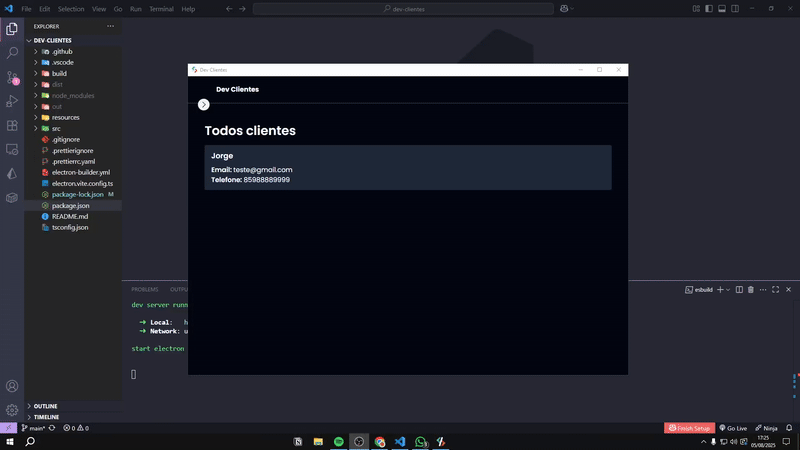
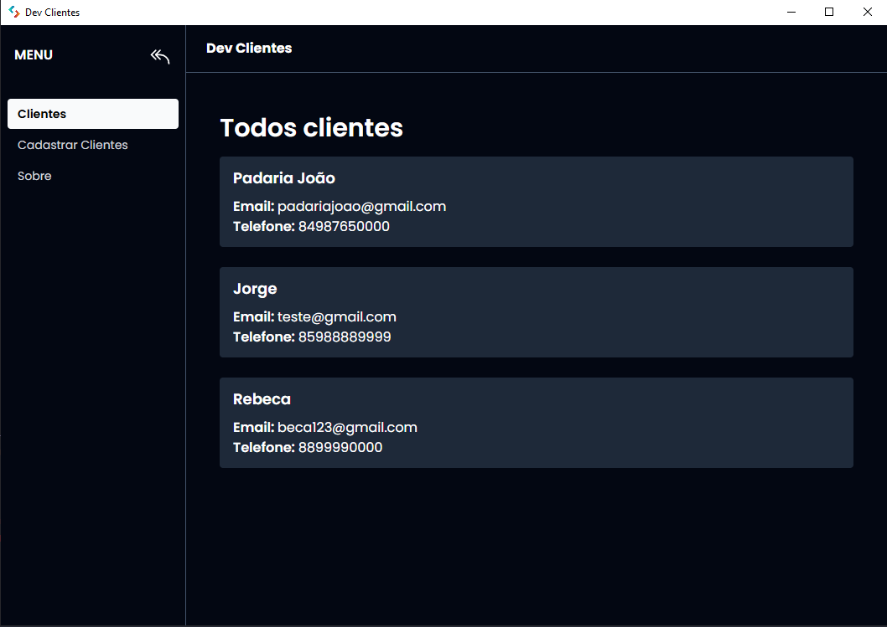
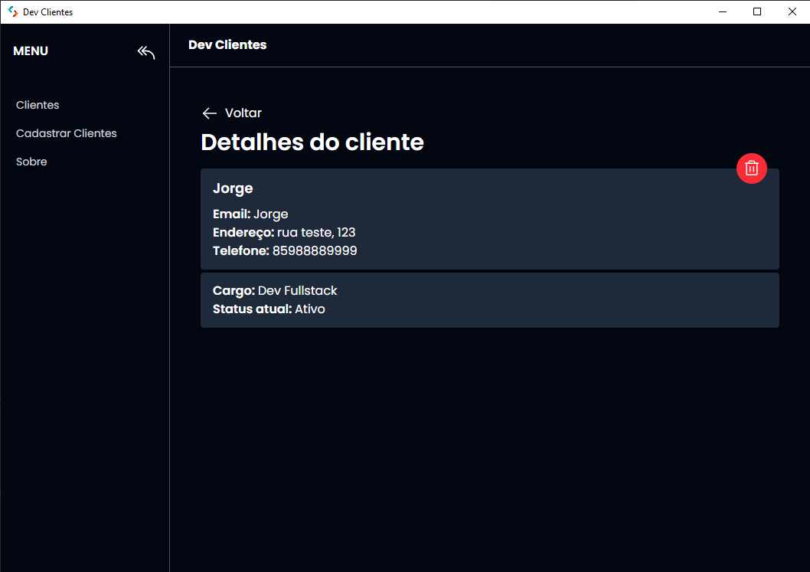
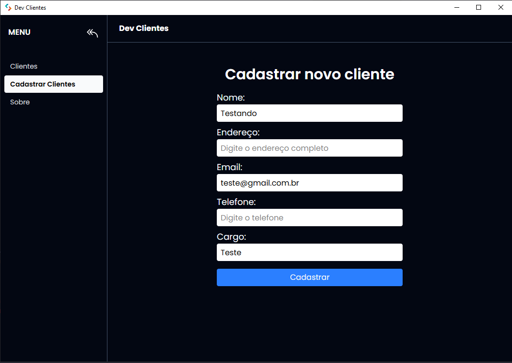
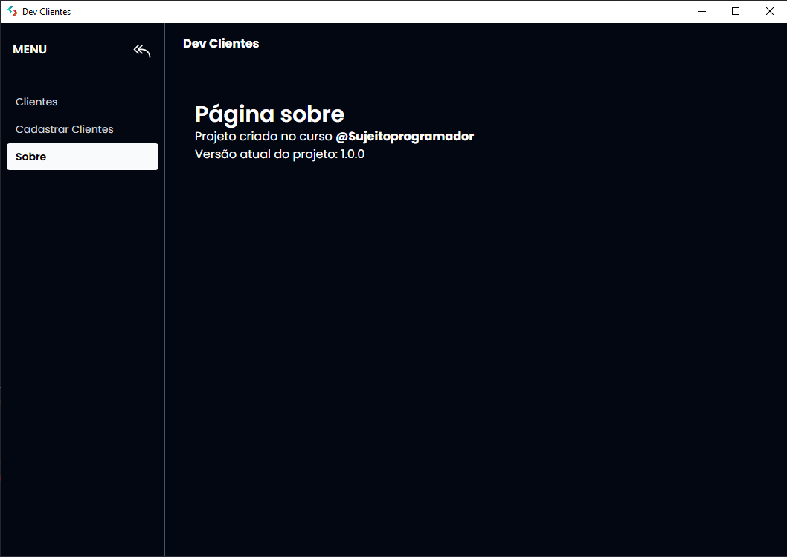
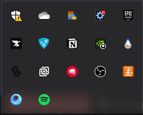
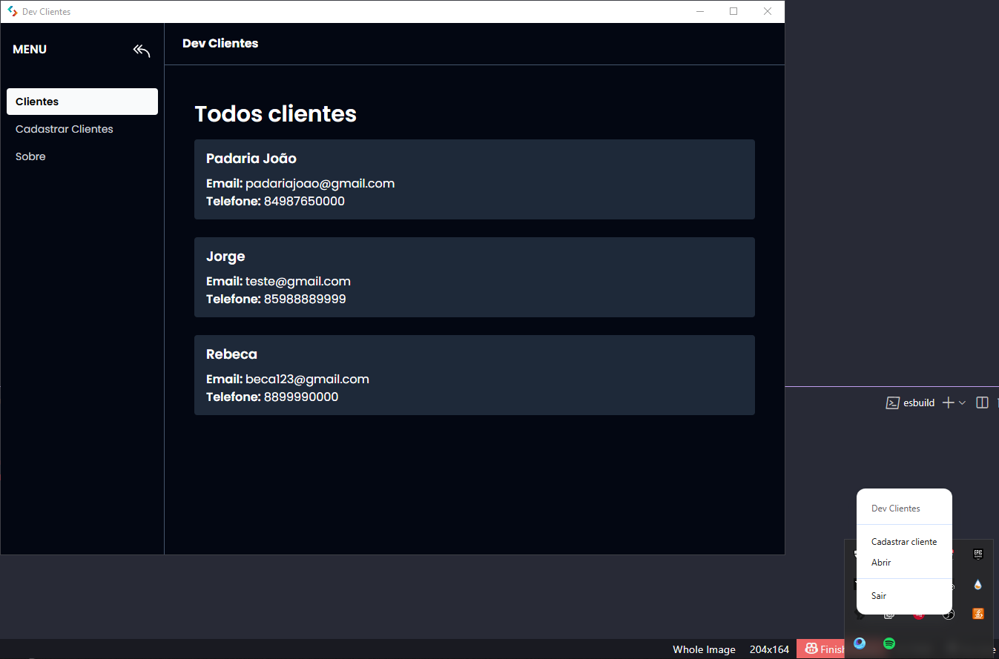

# DevClientes



O **DevClientes** é uma aplicação de nível profissional para cadastro, gerenciamento e exclusão de clientes, ideal para empresas que precisam manter um controle eficiente e local dos dados dos seus clientes. Desenvolvido com _Electron.js_, a aplicação roda como um app desktop multiplataforma, com uma interface moderna e responsiva construída em _React, TailwindCSS, TypeScript_, utilizando _React Query_ para gerenciamento de estado assíncrono e comunicação com o banco de dados local. Os dados dos clientes são armazenados de forma segura e offline através do _PouchDB_, permitindo acesso rápido sem depender de conexões com servidores externos.
A aplicação conta ainda com um **Tray Menu** funcional, que oferece atalhos rápidos para ações como abrir a janela principal, cadastrar novo cliente ou encerrar o aplicativo, tornando a experiência mais fluida e integrada ao sistema operacional.

## Sumário

1. [Visão Geral do Projeto](#visão-geral-do-projeto-funcionalidades-principais)
   - [Gerenciamento completo de clientes](#1-gerenciamento-completo-de-clientes)
   - [Cadastro de novos clientes](#2-cadastro-de-novos-clientes)
2. [Tecnologias Utilizadas](#tecnologias-utilizadas-linguagens-e-ferramentas)
3. [Estrutura do Projeto](#estrutura-do-projeto)
5. [Screenshots](#screenshots)
   - [Desktop](#desktop)
6. [Requisitos para Rodar o Projeto Localmente](#requisitos-para-rodar-o-projeto-localmente)
7. [Rodar o Projeto Localmente](#rodar-o-projeto-localmente)
8. [Autores](#autores)
9. [Licença](#licença)

## Visão Geral do Projeto (Funcionalidades Principais)

### 1. Gerenciamento completo de clientes:

- Na aba principal da aplicação desktop você possui as seguintes opções para realizar o gerenciamento de clientes:
  1. Acompanhamento de todos os clientes cadastrados.
  2. Detalhamento dos dados do cliente, como:
      - Nome
      - Endereço
      - E-mail
      - Telefone
      - Cargo
  3. Exclusão do cliente cadastrado.

### 2. Cadastro de novos clientes:

- Na aba de Cadastrar Clientes há um formulário para o cadastro do cliente com os seguintes dados:
    - Nome
    - Endereço
    - E-mail
    - Telefone
    - Cargo

## Tecnologias Utilizadas (Linguagens e ferramentas)

<table>
    <tr>
      <td align="center">
        <a href="https://www.electronjs.org/pt/">
          
          <br />
          <sub>
            <b>Electron.JS</b>
          </sub>
        </a>
      </td>
      <td align="center">
        <a href="https://tailwindcss.com/">
          
          <br />
          <sub>
            <b>TailwindCSS</b>
          </sub>
        </a>
      </td>
      <td align="center">
        <a href="https://www.typescriptlang.org/">
          
          <br />
          <sub>
            <b>TypeScript</b>
          </sub>
        </a>
      </td>
    </tr>
</table>
<table border-style="none">
  <tr>
    <td align="center">
        <a href="https://pouchdb.com/">
          
          <br />
          <sub>
            <b>PouchDB</b>
          </sub>
        </a>
      </td>
    <td align="center">
      <a href="https://git-scm.com/">
        <br />
        <sub>
          <b>Git</b>
        </sub>
      </a>
    </td>
  </tr>
</table>

## Estrutura do Projeto

O projeto é organizado em vários arquivos para melhor organização do código e separação de interesses:

- `/preload`: É a pasta responsável pelo backend da aplicação, onde relaciona-se as rotas com os serviços de banco de dados;
- `/renderer`: É a pasta responsável pelo frontend da aplicação, onde estruturamos as páginas e consumimos dados e funcionalidades com a API;
- `/main`: É a pasta responsável pela configuração do aplicativo desktop, onde estruturamos as funcionalidades, comandos/atalhos e tray menu;
- `/resources`: É a pasta responsável pelas imagens da aplicação;

## Screenshots

### Desktop








## Requisitos para Rodar o Projeto Localmente

### Node.js e npm:

- Verifique se você tem o Node.js instalado. Caso contrário, faça o download e instale a versão mais recente do Node.js.
- O npm (Node Package Manager) é instalado automaticamente com o Node.js.

### Git:

- Certifique-se de ter o Git instalado em sua máquina. Se não tiver, você pode baixá-lo aqui.

### Editor de Texto ou IDE:

- Escolha um editor de texto ou uma IDE (Ambiente de Desenvolvimento Integrado) para trabalhar no código. Alguns exemplos populares incluem o Visual Studio Code, Sublime Text e Atom.

### Navegador Web:

- Você precisará de um navegador web para visualizar o aplicativo localmente. Recomendamos o uso do Google Chrome, Mozilla Firefox ou Microsoft Edge.

## Rodar o Projeto Localmente

**Clone o projeto**

```bash
  git clone https://github.com/MarcioJorgeMelo/dev-clientes.git
```

**Vá para a pasta do projeto**

```bash
  cd dev-clientes
```

**Abra o projeto no VSCode**

```bash
  code .
```

```bash
  npm install # Instala as dependências (se ainda não tiver feito)
```

**Rode o projeto**

```bash
  npm run dev
```

## Autores

- [@MarcioJorgeMelo](https://github.com/MarcioJorgeMelo)

## Licença

- [MIT](https://choosealicense.com/licenses/mit/)
